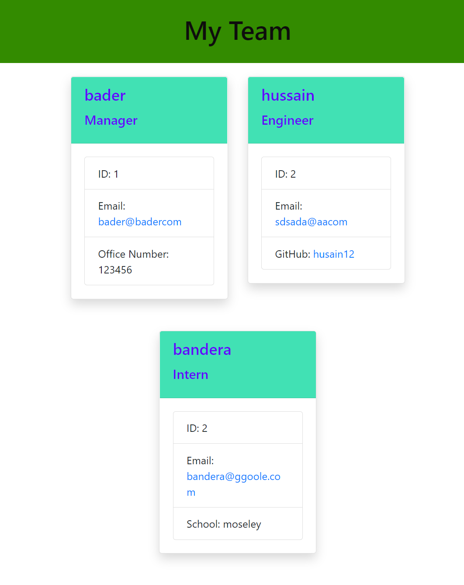

# Team Profile Generator

  
  ## Description:

  

     You are presented with a series of questions to build a page containing a Team consisting of a Manager and as many Engineers and Interns that you desire to have on the team, at the end index html page will be generated with a table like form with all the relevant information displayed.

  # Table of Contents

  - [Walkthrough](#walkthrough)
  - [Installation](#installation)
  - [Usage](#usage)
  - [Credits](#credits)
  - [License](#license)
  - [Contribution](#contributing)
  - [Screenshot](#screenshot)
  - [Contact](#contacts)

  
  ## Installation:

  run ```npm install``` in terminal to install the dependencies. 
  run the tests type ```npm run test``` in the terminal.
  type ```node index.js``` in the console to run the build team app.

  ## Walkthrough
  [WalkThrough Video](https://youtu.be/cHCxy72qJY0)
  
  ## Technologies
  - JavaScript
  - Nodejs

  ## Usage:

  This app will let you create a team consisting of interns and engineers with one manager assigned to them.


  ## Credits:

  Made by Bader Munir


  ## License:

  For more information about licenses, please visit:

  [License](https://opensource.org/licenses/MIT)


  ## Contributing:
  
  It is open source

  ## Screenshot:

  

  
  ## Contact:

  - [Github Profile](https://github.com/XBaderM)

  - [Email](bader.munir18@googlemail.com)
  
 

